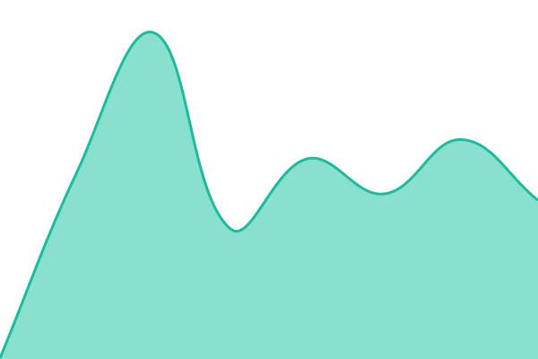
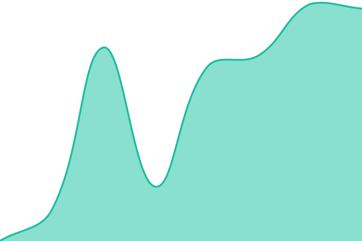
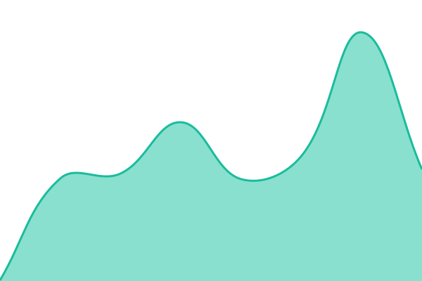
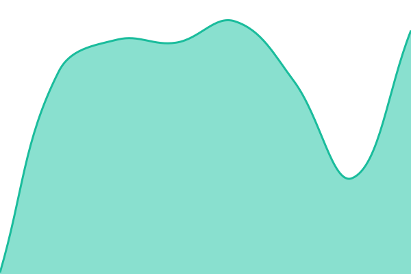

<!--start: status pages-->
<!-- This summary is generated by Upptime (https://github.com/upptime/upptime) -->
<!-- Do not edit this manually, your changes will be overwritten -->
<!-- prettier-ignore -->
| URL | Status | History | Response Time | Uptime |
| --- | ------ | ------- | ------------- | ------ |
|  [Souverain Spine](https://souverain-spine.vercel.app/) | 🟩 Up | [souverain-spine.yml](https://github.com/AVictoroff/Souverain/commits/HEAD/history/souverain-spine.yml) | 

 277ms
     
 | 

<a href="https://souverain-spine.com/history/souverain-spine">100.00%</a>
    

|  [API health](https://souverain-spine.vercel.app/api/health) | 🟩 Up | [api-health.yml](https://github.com/AVictoroff/Souverain/commits/HEAD/history/api-health.yml) | 

 205ms
     
 | 

<a href="https://souverain-spine.com/history/api-health">100.00%</a>
    

|  [Auth signup](https://souverain-spine.vercel.app/auth/signup) | 🟩 Up | [auth-signup.yml](https://github.com/AVictoroff/Souverain/commits/HEAD/history/auth-signup.yml) | 

 168ms
     
 | 

<a href="https://souverain-spine.com/history/auth-signup">100.00%</a>
    

|  [Stripe webhook](https://souverain-spine.vercel.app/api/webhooks/stripe) | 🟩 Up | [stripe-webhook.yml](https://github.com/AVictoroff/Souverain/commits/HEAD/history/stripe-webhook.yml) | 

 138ms
     
 | 

<a href="https://souverain-spine.com/history/stripe-webhook">100.00%</a>
    

<!--end: status pages-->

## 📄 License

- Code: [MIT](./LICENSE) © [Anand Chowdhary](https://anandchowdhary.com), supported by [Pabio](https://pabio.com)
- Data in the `./history` directory: [Open Database License](https://opendatacommons.org/licenses/odbl/1-0/)
